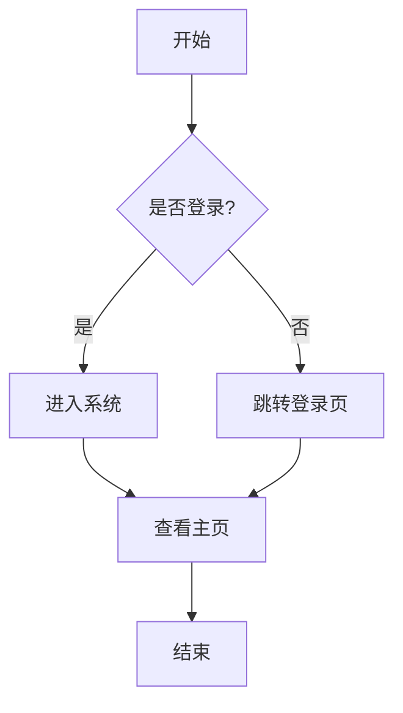
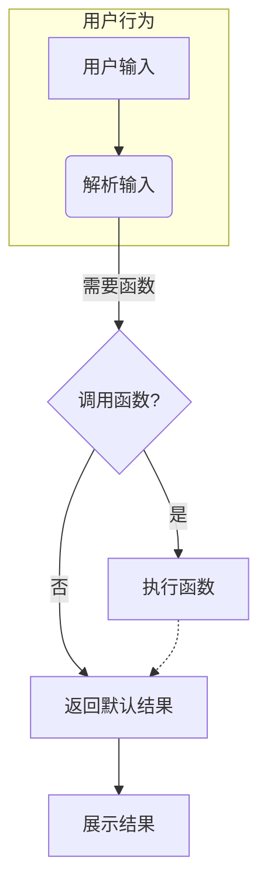

`graph TD` 是 [Mermaid](https://mermaid.js.org/) 流程图语法中的一种，用来从上到下（Top Down）绘制流程图或结构图。

---

## ✅ 一、基本语法概览

### 1. **声明方向**

```mermaid
graph TD
```

* `TD`：Top Down（从上到下）
* 其他方向：

  * `LR`: Left to Right（从左到右）
  * `RL`: Right to Left
  * `BT`: Bottom to Top

---

### 2. **创建节点**

```mermaid
A[矩形节点]
B(圆角节点)
C((圆形节点))
D>右尖角节点<]
E{{菱形节点（用于判断）}}
F[/斜边矩形\]
G[Text with space]
```

---

### 3. **连接箭头**

```mermaid
A --> B          // 普通箭头
B -- Yes --> C   // 带标签的箭头
C -.-> D         // 虚线箭头
D ==> E          // 粗线箭头
```

---

### 4. **定义子图（子流程）**

```mermaid
subgraph MySubgraph
    A --> B
end
```

---

### 5. **注释**

```mermaid
%% 这是注释，不会被渲染
```

---

## ✅ 二、常用语法

### 示例：简单流程图



---

### 示例：子图 + 虚线箭头 + 标签



---

## ✅ 三、常用节点样式

| 语法形式       | 节点样式        | 示例代码        |
| ---------- | ----------- | ----------- |
| `[text]`   | 矩形节点        | `A[Text]`   |
| `(text)`   | 圆角矩形        | `A(Text)`   |
| `((text))` | 圆形节点        | `A((Text))` |
| `>text<`   | 尖角节点        | `A>Text<`   |
| `{{text}}` | 决策/判断节点（菱形） | `A{{Text}}` |
| `[/text\]` | 斜角矩形（数据）    | `A[/Text\]` |
| `-->`      | 实线箭头        | `A --> B`   |
| `-.->`     | 虚线箭头        | `A -.-> B`  |
| `==>`      | 粗线箭头        | `A ==> B`   |

---

## ✅ 四、推荐工具

* [Mermaid Live Editor](https://mermaid.live)（可视化编辑）
* Obsidian / Typora / VS Code + Markdown Preview Enhanced
* 支持 Mermaid 的 Notion / GitHub README（有限支持）

